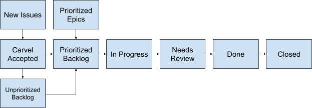

# Backlog Management
We use [GitHub Project for backlog
management](https://github.com/orgs/vmware-tanzu/projects/16) (note: The backlog
is configured as a single, consolidated backlog. If you're interested in only
seeing a specific tool's backlog then we recommend using the filters
accordingly.

## How the Backlog is Organized
The below graphic is an overview of how issues flow through our backlog. Each box refers to a backlog column.

| Column (State) | Description | Labels Used | How does an issue progress from this column? Where does it go next? |
| --- | --- | --- | --- |
| To Triage / No Status | Issues to be reviewed and labeled by the Carvel maintainer team in order to determine the next steps. | * `carvel-triage` (add) * any other categorical labels (such as `bug` or `enhancement`) | A Carvel maintainer will triage this issue to determine what’s needed for this issue. This could mean answering a question, clarifying the problem with the requester, determining product viability, or something else. While information is being collected, issues will remain in this column. Once sufficient information is collected and the issue is product viable, then the issue will move to the **Carvel Accepted** column. |
| Carvel Accepted | Issues that are product viable requiring prioritization consideration. | * `carvel-triage` (remove) * `carvel accepted`(add) | A subset of Carvel leadership (product and engineering) will review these stories on a weekly basis to determine whether these stories should be placed in the **Prioritized** (upcoming planned work) or the **Unprioritized** (unplanned work). |
| Unprioritized | Issues that have been accepted from a product perspective but are not prioritized for the Carvel maintainer team in the near future. Community members are encouraged to see if any of these issues are something they want to work on. Contributions are welcome. | | Regular reviews of the **Unprioritized** by Carvel maintainers can prompt the graduation of issues to the **Prioritized**. |
| Prioritized Epics | A prioritized list of epics that Carvel maintainers are planning to work on. | | When all of the stories within an epic are completed the issue will be moved to **Done**. When all of the stories within an epic are released the issue will be moved to **Closed**. |
| Prioritized | A prioritized list of issues that are planned to be worked on by Carvel maintainers. If a community member would like work on one of these, please coordinate with the maintainers in the GitHub Issue comments. | | When work on an issue begins, the person working on the issue will assign themselves to the task and move the issue to In **Progress**. |
| In Progress | Issues currently being worked on by Carvel maintainers or a community member. | * `in-progress` (add) | When work on an issue is ready for review, the person working on the issue will move the issue to **Needs Review**. |
| Needs Review | Issues that are ready for review. Code complete, pending feedback. | | After an issue is reviewed, the issue will either be approved and merged or it will require further changes. If the issue is approved and merged, the issue should be moved to **Done**. If the issue requires further changes, it can remain in **Needs Review** until approved. |
| Done | Issues that have been approved and are waiting to be released. | | After this work is included in a published release, the issue can be moved to **Closed**.
| Closed | Issues that have been released, resolved or deemed not product viable. | * `in-progress` (remove) | |

